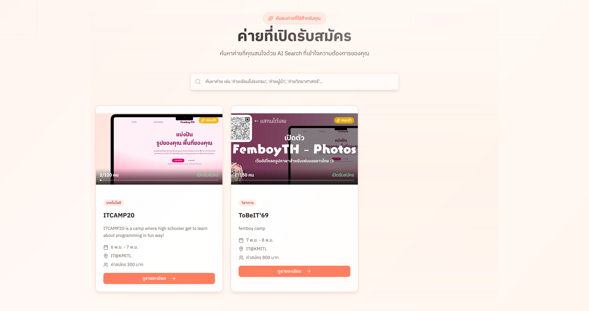
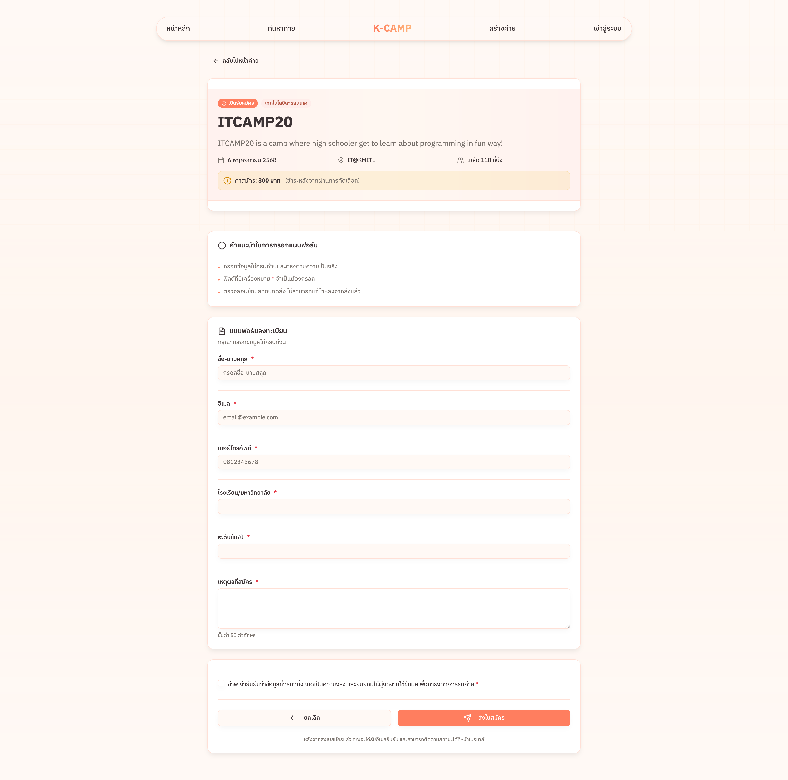
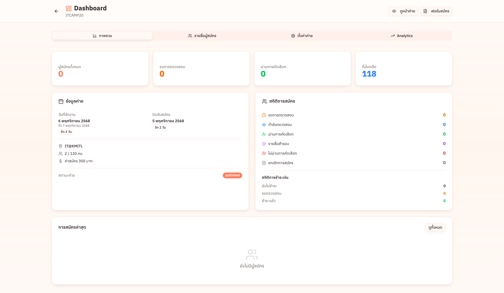

# K-CAMP

> A comprehensive platform for discovering and managing university camps and events at KMITL

K-CAMP streamlines the process of organizing camps by providing ready-to-use templates for registration websites and forms, while creating a centralized discovery hub for students seeking opportunities across all faculties.

## ✨ Project Preview
### Video 🎬

<p align="center" width="100%">
<video src="https://github.com/user-attachments/assets/88f7108f-abfd-45a8-b697-5293ef08ee59" width="80%" controls></video>
</p>

### Image 🖼️







\## ✨ Features

- 🔍 **AI-Powered Search** - Semantic search to find camps by meaning, not just keywords
- 📝 **Camp Management** - Create and manage camps with a powerful dashboard
- 👥 **Registration System** - Handle participant registrations with status tracking
- 📊 **Analytics Dashboard** - Track views, registrations, and conversion rates
- 🎨 **Beautiful UI** - Modern design with shadcn-svelte components
- 📱 **Responsive Design** - Works seamlessly on desktop, tablet, and mobile
- 🔐 **Authentication** - Secure login with PocketBase

## 🛠 Tech Stack

**Frontend:**
- [SvelteKit](https://kit.svelte.dev/) - Web framework
- [TailwindCSS](https://tailwindcss.com/) - Styling
- [shadcn-svelte](https://www.shadcn-svelte.com/) - UI components
- [Lucide Icons](https://lucide.dev/) - Icon library

**Backend:**
- [PocketBase](https://pocketbase.io/) - Database & Authentication
- SvelteKit Server Actions - API endpoints

## 📋 Prerequisites

Before you begin, ensure you have installed:
- **Node.js** (v18 or higher)
- **npm** or **pnpm** or **yarn**
- **PocketBase** (for the backend)

## 🚀 Quick Start

### 1. Clone the repository

```bash
git clone https://github.com/SICout9010/K-Camp.git
cd K-Camp
```

### 2. Install dependencies

```bash
npm install
# or
pnpm install
# or
yarn install
```

### 3. Set up environment variables

Create a `.env` file in the root directory:

```env
PUBLIC_POCKETBASE_URL=http://127.0.0.1:8090
```

### 4. Start PocketBase

Download and run PocketBase:

```bash
# Download PocketBase from https://pocketbase.io/docs/
# Then run:
./pocketbase serve
```

PocketBase will be available at `http://127.0.0.1:8090/_/`

### 5. Configure PocketBase Schema

Refer to `docs/POCKETBASE_SCHEMA.md` for the complete database schema setup.

### 6. Start the development server

```bash
npm run dev
# or with auto-open
npm run dev -- --open
```

The app will be available at `http://localhost:5173`

## 📁 Project Structure

```
k-camp/
├── src/
│   ├── lib/
│   │   ├── components/      # Reusable components
│   │   │   ├── ui/         # shadcn-svelte components
│   │   │   ├── CampCatalog.svelte
│   │   │   ├── Header.svelte
│   │   │   └── ...
│   │   └── utils.ts        # Utility functions
│   ├── routes/
│   │   ├── +page.svelte                    # Homepage
│   │   ├── auth/                           # Authentication
│   │   ├── camp/
│   │   │   └── [slug]/
│   │   │       ├── +page.svelte           # Camp detail page
│   │   │       ├── dashboard/             # Organizer dashboard
│   │   │       └── register/              # Registration form
│   │   └── create-camp/                   # Camp creation
│   ├── app.css             # Global styles & theme
│   ├── app.html            # HTML template
│   └── hooks.server.ts     # Server hooks (auth, PocketBase)
├── docs/                   # Documentation
│   ├── CONTEXT.md         # Project context & roadmap
│   └── POCKETBASE_SCHEMA.md # Database schema
├── static/                 # Static assets
└── package.json
```

